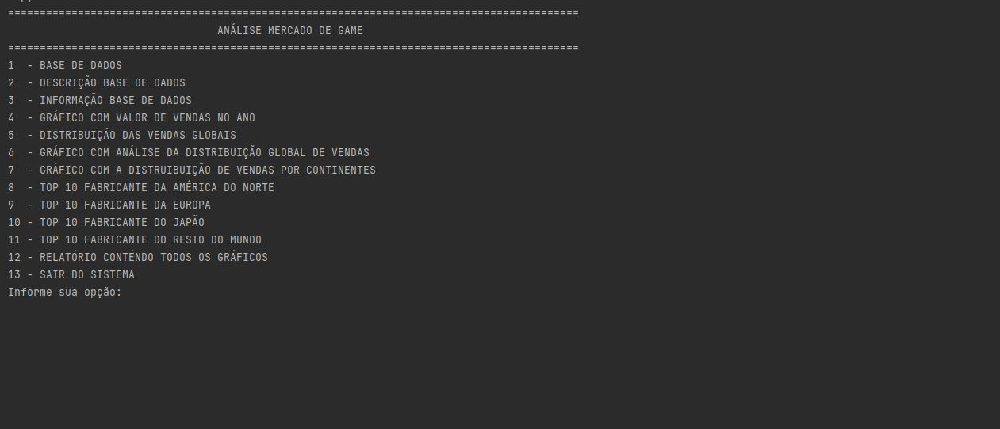
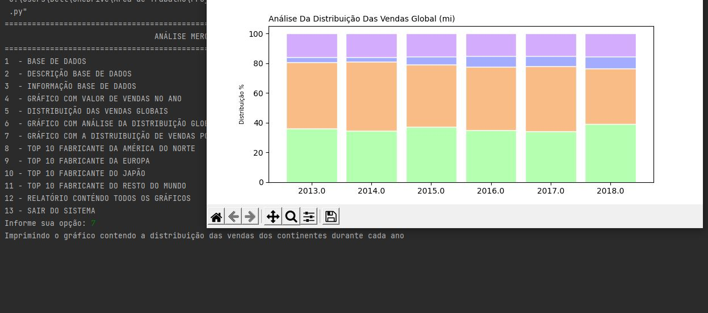
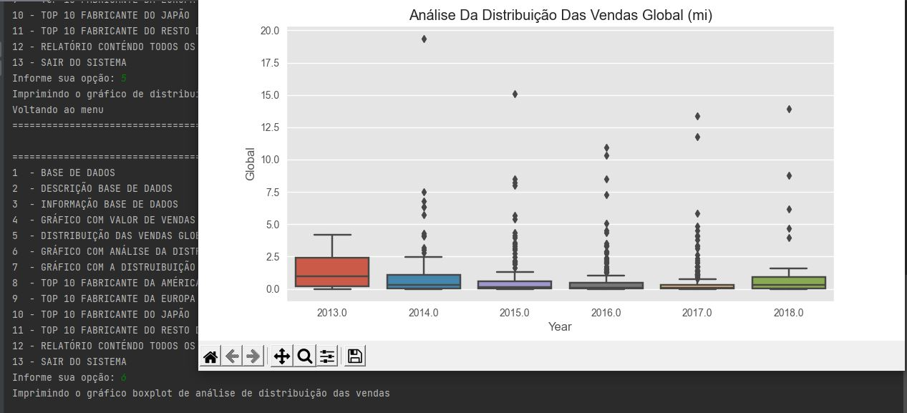
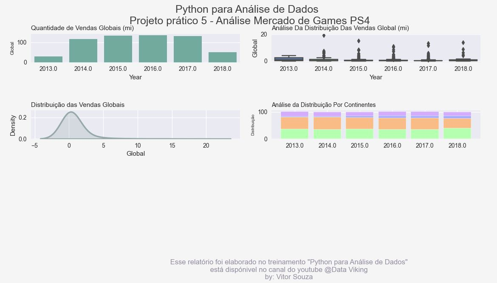
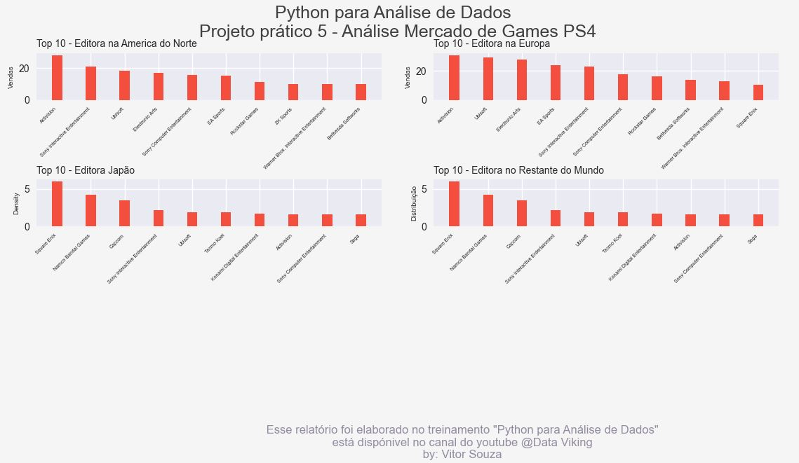

# kaggle-database-analysis
**Creating python projects for analyzing and visualizing kaggle 
database data**

# Projects

## 1 - Mercado game 

Nesse projeto foi realizado uma análise e visualização de uma base de dados 
do site kaggle que contém os dados de vendas de jogos de PS4 no Norte 
Americano, Europa, Japão e no Restante do Mundo. 

Base de dados Kaggle: 
[Video Games Sales Dataset](https://www.kaggle.com/datasets/sidtwr/videogames-sales-dataset?datasetId=189386&sortBy=voteCount)

### Imagens

### Ambiente de desenvolvimento

Esse projeto foi desenvolvido pela linguagem Python na versão
3.10.5 e utilizando a biblioteca *Pandas*, *Matplotlib*, *Seaborn* para 
análise, visualização e plotagem dos gráficos. 

### Meta 

Vitor Hugo Silva Souza | E-mail: vitorsouzasilvaa@hotmail.com

 
 

